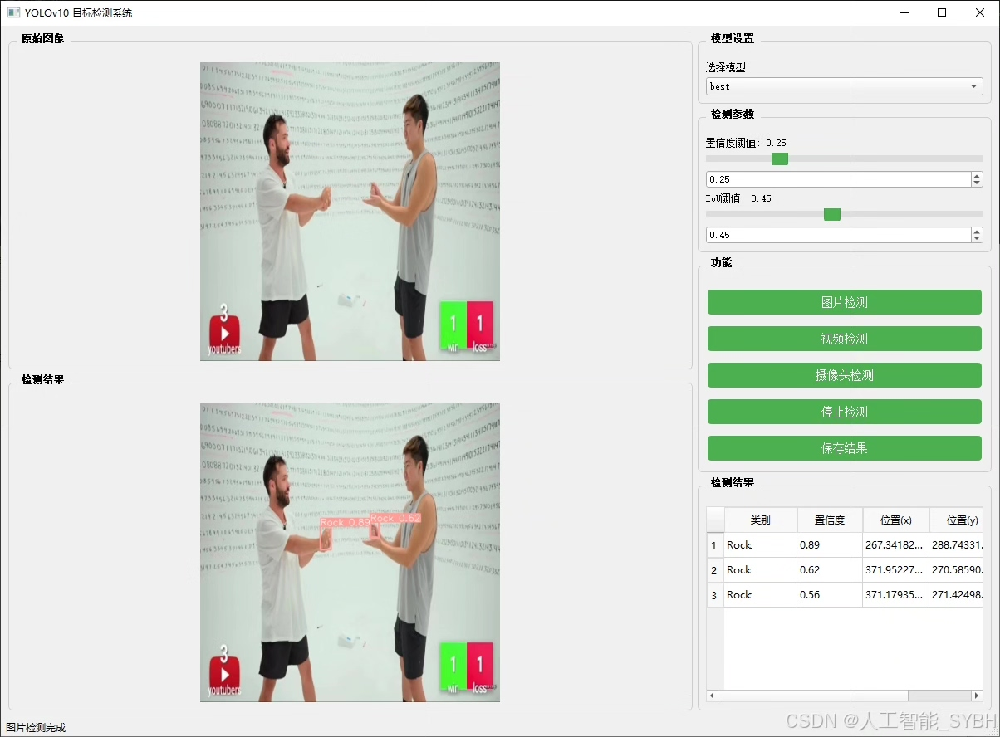
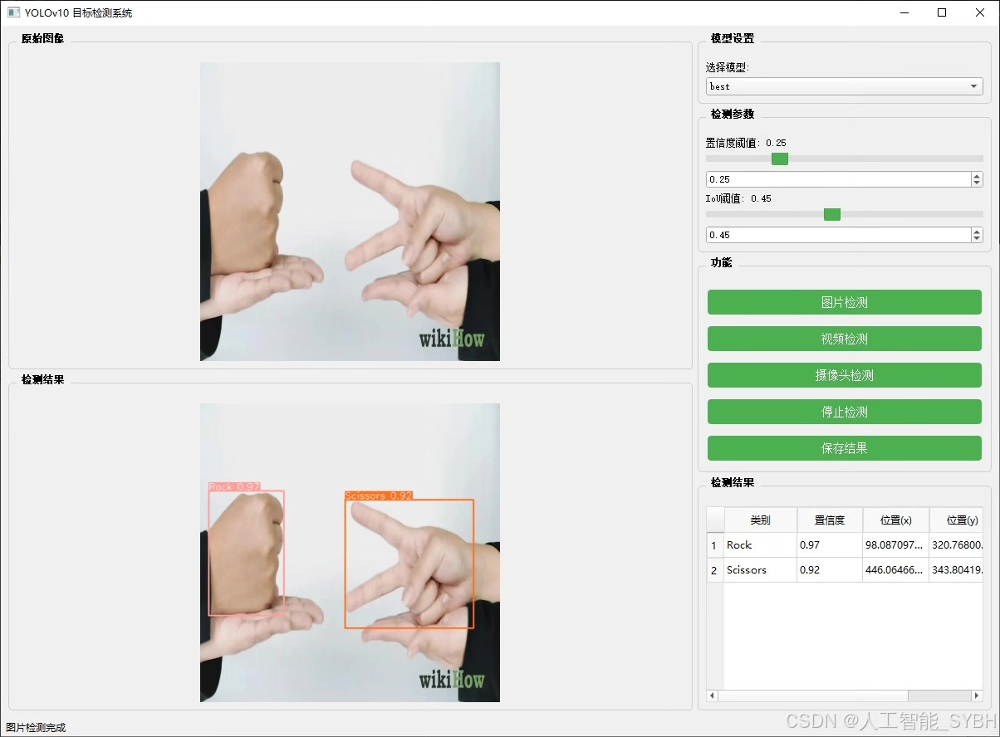
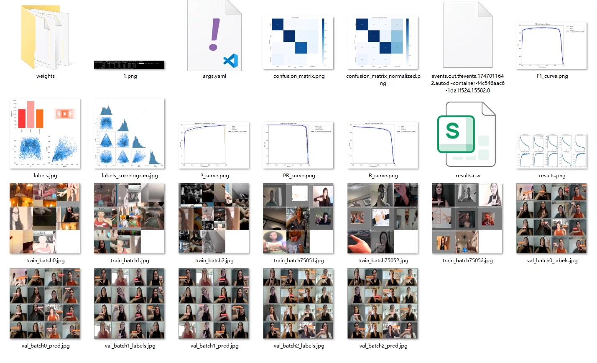
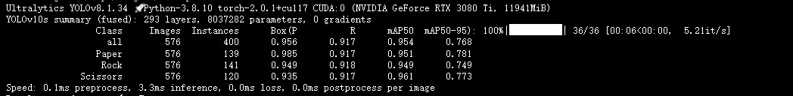
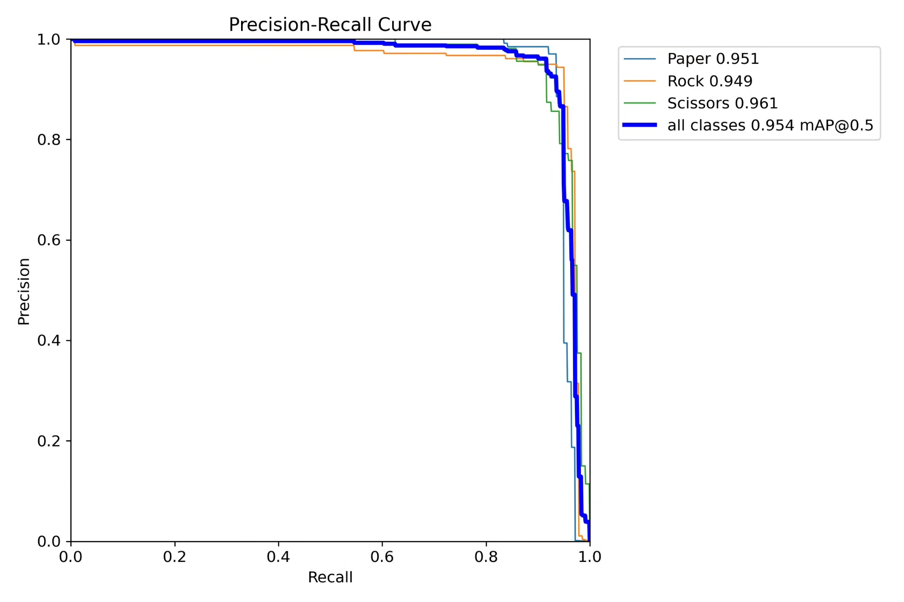
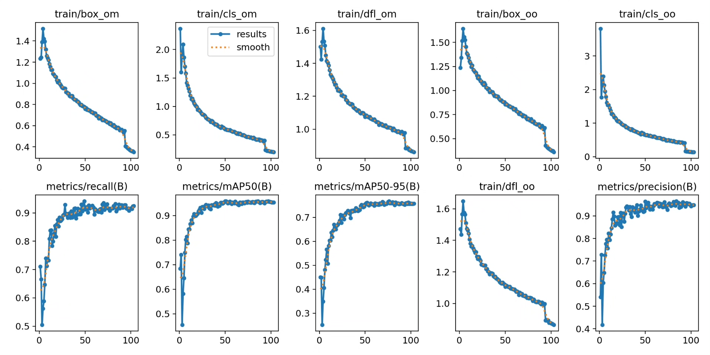
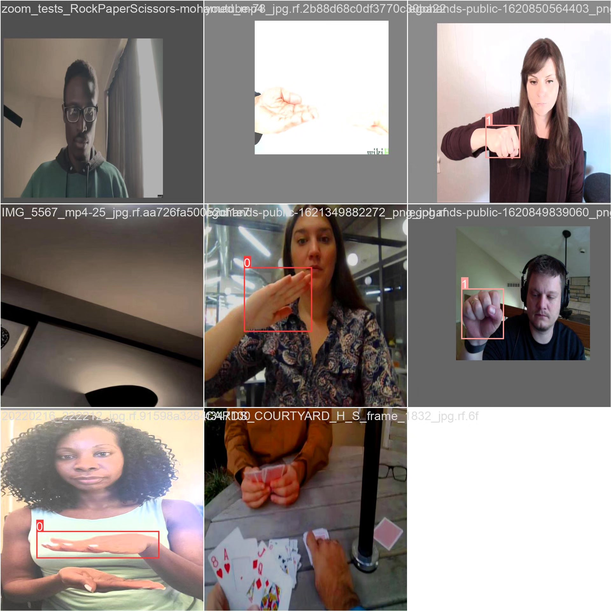

# Stone-paper-scissors detection system based on deep learning YOLOv10

## Body

This project develops a stone-paper-scissors gesture recognition system based on the YOLOv10 object detection algorithm, capable of real-time detection and classification of the "rock", "scissors", and "paper" gestures displayed by users. The system is trained using a custom dataset, which includes 6455 training images, 576 validation images, and 304 test images, totaling 7335 labeled images. Experiments show that YOLOv10 performs excellently in this gesture recognition task, achieving a balance between high accuracy and real-time performance. This system can be widely applied in various scenarios such as human-computer interaction games, intelligent teaching aids, and assistive devices for people with disabilities, providing a new technical solution for natural human-computer interaction.

The company's products have obtained the official commercial license certification from YOLO.

We provide after-sales service:

After payment, we will provide WeChat ID to answer questions at any time.

Environment configuration: We will provide an instructional tutorial on environment setup, and WeChat will provide答疑.

Remote installation service: If you need remote configuration, an additional fee of 69 is required,

Configuration failure will result in all fees being refunded (only installation fees are refunded for older computers).

Retraining dataset: After setting up the environment, you can train on your own computer.
If you need us to retrain, just pay 69 plus computing power fees (2.5 yuan/hour)

## Images

## Payment

Here is a pay link on Stripe ( https://buy.stripe.com/3cs8yP7sY87d0vu9AB ). Please contact me lonlonago@foxmail.com after funding $89, and I will send you a complete data files , thank you!

